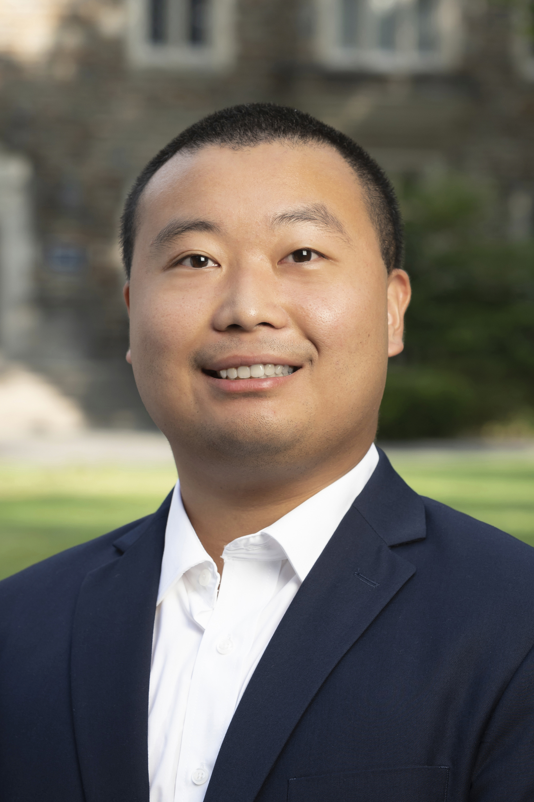

  

    <h3 style="margin-bottom: 20px; color: #333;">Welcome to my website!</h3>
    
    
I am a PhD student in Public Policy (Economics Track) at Harvard Kennedy School.

    
    
My research lies at the intersection of the economics of crime, law & economics, and political economy. I am especially interested in how social movements, policy design, and institutional incentives generate or mitigate racial disparities in the criminal justice system. A large part of my current agenda examines the political economy of police‑alternative programs in the United States.

    
    
Before Harvard, I earned an M.A. in Economics at Duke University and served as a research assistant to Professor Bocar Ba and Professor Tony Cheng on policing projects, and to Professor Jonathan Petkun on judicial retirement.

  

  
  

    
  

## Education
- **Ph.D** in Public Policy (Economics Track), Harvard University, 2025-Present
- **M.A.** in Economics, Duke University, 2023-2024
- **B.A.** in Economics, History Minor, University of Michigan

